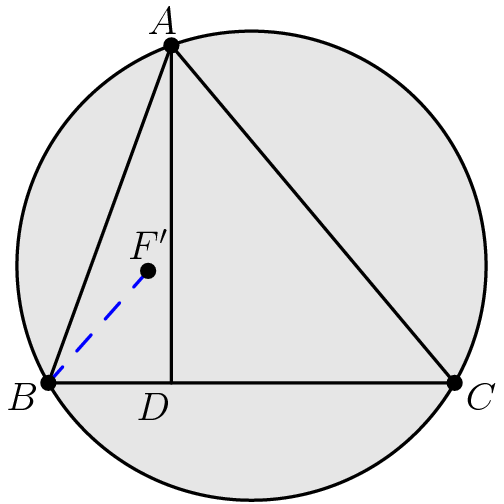

# TSQX

[Asymptote](https://asymptote.sourceforge.io/) preprocessor
for Euclidean geometry diagrams
descended from the older [TSQ](https://github.com/vEnhance/dotfiles/blob/main/py-scripts/tsq.py).

## Installation

`pip install tsqx`

## Documentation

See [wiki](https://github.com/cjquines/tsqx/wiki/Documentation).

## Example code

```
~triangle A B C
D ;= foot A B C
E := midpoint A--B
F' N = (rotate -30 E)(extension A (foot A B C) C E)

circumcircle A B C / 0.2 lightgray /
A--B--C--cycle
A--D
B--F' / dashed blue
```

Generated code:

```
pair A = dir(110);
pair B = dir(210);
pair C = dir(330);
pair D = foot(A, B, C);
pair E = midpoint(A--B);
pair F_prime = rotate(-30, E)*extension(A, foot(A, B, C), C, E);

filldraw(circumcircle(A, B, C), opacity(0.2)+lightgray, defaultpen);
draw(A--B--C--cycle);
draw(A--D);
draw(B--F_prime, dashed+blue);

dot("$A$", A, dir(A));
dot("$B$", B, dir(B));
dot("$C$", C, dir(C));
label("$D$", D, dir(D));
dot("$F'$", F_prime, plain.N);
```

Which makes the diagram:


